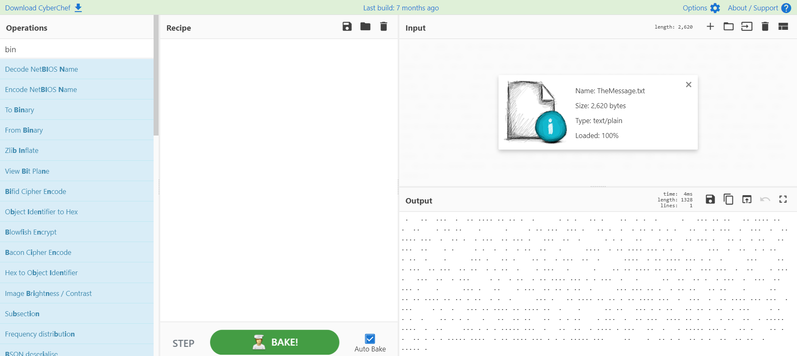
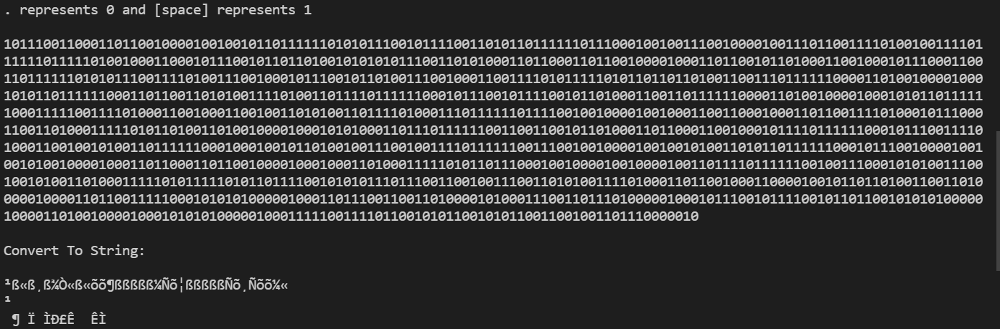
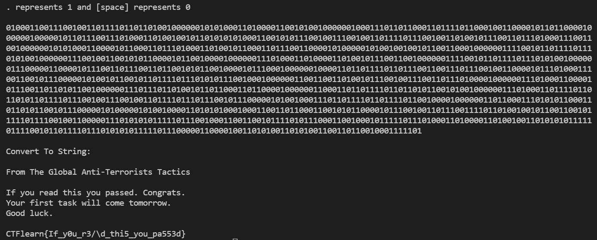

# Blank Page
**Category:** Forensics


## Problems

```
I've just graduated the Super Agent School. This is my first day as a spy. The Master-Mind sent me the secret message, but I don't remember how to read this. Help!
```
[TheMessage.txt](https://ctflearn.com/challenge/download/959)


## Solution
From file we got, if wee see it directly from notepad we got blank file. So, I try to check file with CyberChef and we got dot and space value.



At first we will think its a morse code but morse code consists of . and -. So this is not a morse code instead its a binary. of course I don't know which one is represents 0 or 1.

So I tried both ways and got result like this




----------------------------------------------------------




So We got our flag : `CTFlearn{If_y0u_r3/\d_thi5_you_pa553d}`
